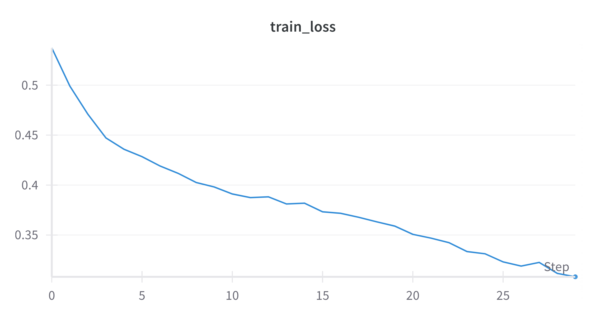
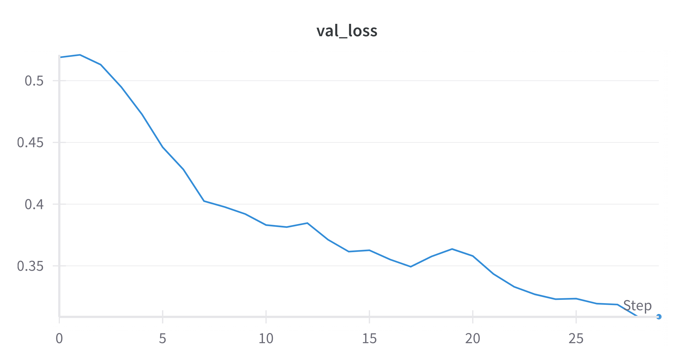

# Polygon Coloring with Conditional UNet

## 📌 Problem Statement
This project implements a **Conditional UNet** to fill a polygon outline image with a specified color.  
The model takes two inputs:
1. **Polygon outline image** (e.g., triangle, square, octagon)
2. **Color name** (e.g., red, blue, yellow)  

**Output:**  
An RGB image of the same polygon filled with the given color.

---

## 📂 Dataset
The dataset consists of paired inputs (polygon + color) and outputs (colored polygon).  

Folder structure:
dataset/
training/
inputs/ # Polygon outline images
outputs/ # Corresponding colored polygons
data.json # Mapping polygon image + color → output image
validation/
inputs/
outputs/
data.json

yaml
Copy
Edit

**Note:** The dataset JSON key `"colour"` (British spelling) was handled in preprocessing.

---

## 🏗 Model Architecture
- **Base model:** UNet  
- **Conditioning:**  
  - One‑hot encode color  
  - Pass through a Linear layer to produce a **64‑dimensional embedding**  
  - Expand embedding to a `(64 × H × W)` tensor and concatenate with polygon image along the channel dimension  
- **UNet Encoder–Decoder:**  
  - Downsampling path: 3 convolutional blocks with MaxPooling  
  - Bottleneck: 512 channels  
  - Upsampling path: transposed convolutions with skip connections  
- **Output:** 3‑channel RGB image with `sigmoid` activation.

---

## ⚙ Hyperparameters
| Parameter       | Value   |
|-----------------|---------|
| Image Size      | 128×128 |
| Batch Size      | 8       |
| Learning Rate   | 1e-4    |
| Epochs          | 30      |
| Loss Function   | L1 Loss |

---

## 📊 Training Details
- **Framework:** PyTorch  
- **Experiment Tracking:** Weights & Biases  
- **GPU Used:** NVIDIA GPU (local training)  

**W&B Run Link:**  
[Click here to view run](https://wandb.ai/kpaishwarya001-ayna/polygon-coloring/runs/5zlgxe2i)

**Training Curves:**  
- 
- 

---

## 🖼 Example Predictions
The following are predictions from the trained Conditional UNet model.  
All generated outputs are available in the `predictions/` folder.

**Combined Results (4x4 format)**  


**Sample Individual Predictions:**
- 
- 
- 
- 

---

## 🚀 How to Run

### 1. Install dependencies
```bash
pip install -r requirements.txt
2. Train the model
bash
Copy
Edit
python3 train.py
3. Run inference
Open and run inference.ipynb — provide:

Path to polygon image

Desired color name (must exist in dataset colors)

The notebook will display predictions and save them inside predictions/.

🛠 Challenges & Fixes
Dataset key mismatch: The JSON file used "colour" instead of "color" → fixed in dataset loader.

Shape mismatches: Ensured train and validation datasets share the same n_colors.

Color conditioning issues: Fixed embedding expansion to match UNet input dimensions.

📚 Key Learnings
Implementing Conditional UNet from scratch in PyTorch

Handling multi‑input models (image + categorical input)

Using W&B for experiment tracking

Debugging shape mismatches and aligning dataset mappings

📄 Report
A detailed report covering architecture, hyperparameters, training process, and insights is available here:
📄 ayna_assignment_report.pdf